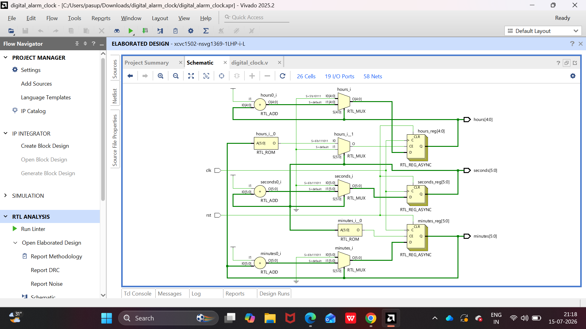

# digital_clock
Digital Clock using Verilog HDL Designed and implemented a 24-hour digital clock in Verilog HDL that displays hours, minutes, and seconds. The project uses sequential logic, counters, and synchronous reset, demonstrating fundamental digital design concepts and RTL simulation.
## RTL Design

### 1. Digital Clock RTL Schematic

### 2. Digital Clock Testbench RTL Schematic

 
